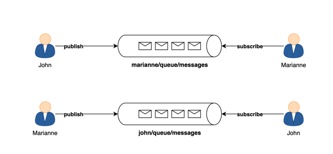
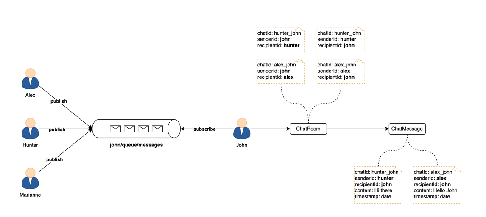

# Project Name

One On One Chat application | Spring boot & WebSocket | By Alibou

## Overview

Explore the world of **WebSockets** with **Alibou**, your experienced software engineer guide. If you missed our previous session delving into the magic of WebSockets and creating a lively group chat application, catch up [here](https://www.youtube.com/watch?v=7T-HnTE6v64&ab_channel=BoualiAli).

Today's focus is on real-time communication, as we build a **one-on-one chat application** that ensures private, secure conversations. Taking it a step further, we'll persist these chats in a **MongoDB database**.

Before diving into the code, a special mention for those keen on deepening their understanding of WebSockets. If you haven't checked out the introduction in the previous video, find the link in the description [here](https://www.youtube.com/watch?v=TywlS9iAZCM&t=808s&ab_channel=BoualiAli).

🔔 If you're not part of our community yet, consider hitting that star button! Stay tuned for weekly releases of engaging content where we explore, learn, and code together.

👨‍💻 I'm Alibou, excited to guide you through today's exploration. Let's embark on this coding adventure together, building a one-on-one chat application, uncovering WebSockets intricacies, and mastering the art of data persistence in MongoDB.

---

#### Here is a demo of the application


#### Full Tutorial link

[Watch the Tutorial](https://www.youtube.com/watch?v=7T-HnTE6v64&ab_channel=BoualiAli)


## Table of Contents

- [Features](#features)
- [Installation](#installation)
- [Technologies](#technologies)

## Features

- One to one chat application
- Secure communication
- Persistent chat



---



---

## Installation

Provide step-by-step instructions on how to install and set up your project locally.

```bash
# Clone the repository
git clone https://github.com/ali-bouali/one-to-one-chat-spring-boot-web-socket

# Change into the project directory
cd your-project

# Build the project
./mvnw clean install
```

---
## Technologies

This project is mainly implement using the following technologies

- Websocket
- Spring Boot 3.x.x
- MongoDB
- Javascript
- HTML
- CSS

---

